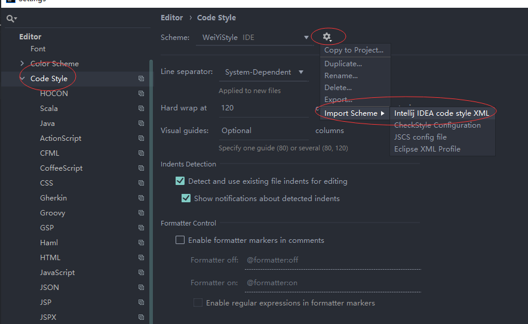
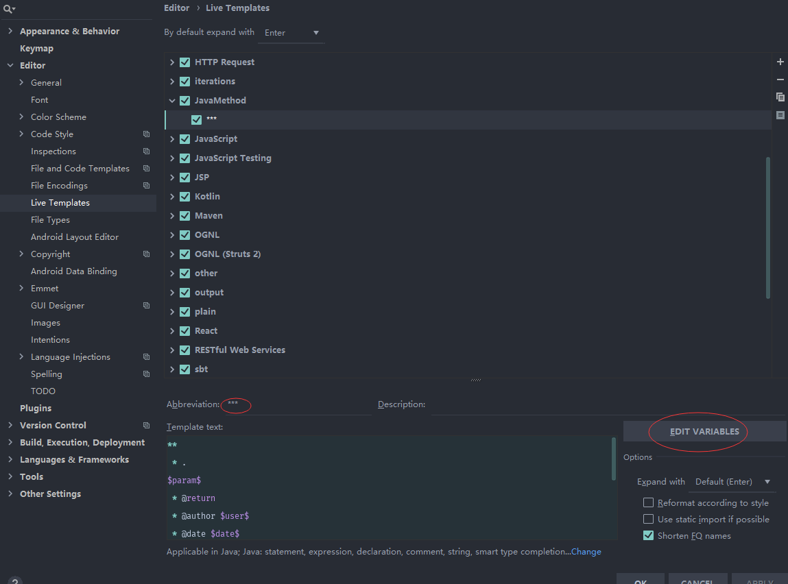
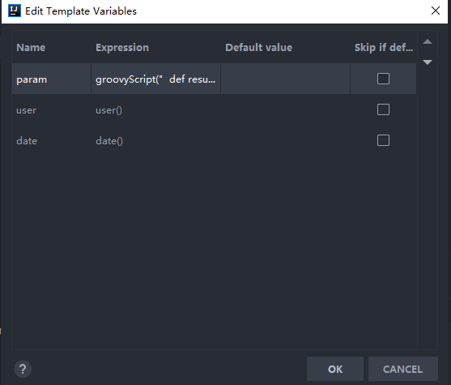

编码规范文档
==============
# 前言
在平时工作中，团队协作是一个必不可少的环节，代码风格迥异或者代码格式不规范都会影响开发效率，影响代码质量，所以工作中应该强制要求自己和团队成员使用统一的CodeStyle设置去规范代码，保持代码风格统一，这样能减少不必要的开发工作，能够事半功倍，提高工作效率

## IDEA 基本规范设置
* 统一 JDK 和 Language Level：采用 JDK8、8 - Lambdas, type annotations etc.
* 统一文件编码：UTF-8
## Java 代码规范
* 阿里巴巴JAVA开发手册1.5.0-华山版.pdf
* 业务逻辑复杂，必须在业务编写过程注释
* 单元测试
* VO、DTO、domain 选择场景（POJO 是这类的统称）
* 异常的处理原则
* 日志输出，额外要有输出 JSON 格式的版本
* 复数变量命名：
>* List：categoryList
>* Map：categoryMap
>* Set：categorySet
* 方法命名规则
>* list :findCategoryList
>* 单个 :getCategory
>* 分页 :findCategoryPaged

## 使用java-google-style
### 导入code style
file->setting->Editor->Code Style

## 文档注释说明
 文档注释分为三部分。先举例如下。　　
```   
       /** 　
    　　　* show 方法的简述.　　
    　　　* ＜p＞show 方法的详细说明第一行＜br＞　　
    　　　* show 方法的详细说明第二行　　
    　　　* @param b true 表示显示，false 表示隐藏　　
    　　　* @return 没有返回值　　
    　　　*/　　
    　　public void show(boolean b) {　　
    　　　　frame.show(b);　　
    　　}
```    
>* 第一部分是简述，列表中属性名或者方法名后面那段说明就是简述。简述部分写在一段文档注释的最前面，第一个点号 (.) 之前 (包括点号)。换句话说，就是用第一个点号分隔文档注释，之前是简述，之后是第二部分和第三部分。如上例中的 “* show 方法的简述.”。
有时，即使正确地以一个点号作为分隔，javadoc 仍然会出错，把点号后面的部分也做为了第一部分。为了解决这个问题，我们可以使用一个 ＜p＞ 标志将第二分部分分开，如上例的“* ＜p＞show 方法的详细说明第一行 ….”。　　

>* 第二部分是详细说明部分。该部分对属性或者方法进行详细的说明，在格式上没有什么特殊的要求，可以包含若干个点号。　　

>* 第三部分是特殊说明部分。这部分包括版本说明、参数说明、返回值说明等。第三部分在上例中相应的代码是： 
　　* @param b true 表示显示，false 表示隐藏 ，* @return 没有返回值，除了 @param 和 @return 之外，还有其它的一些特殊标记，分别用于对类、属性和方法的说明。 
## file code and templates
version 需要在每次迭代版本开发时设置
```
/**   
* 
* .
* @author ${USER}
* @date ${DATE}
* @version 19s3.1015    
*/
```
## live template
```
**
 * .
$param$
 * @return 
 * @author $user$ 
 * @date $date$
 * @version 19s3.1015_实验室自查工具				
 */
```

```groovy
groovyScript("  def result = '';  def param = \"${_1}\".replaceAll('[\\\\[|\\\\]|\\\\s]', '').split(',').toList();  for(int i = 0;i < param.size();i++)  {         result += ' * @param ' + param[i] + ((i < param.size() - 1) ? '\\n' : '');  }; return result; ",methodParameters())
```




