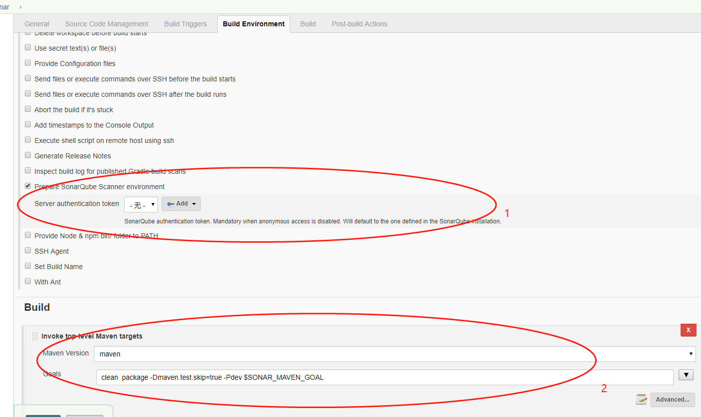

sonar 与CQB整合文档
==============
## 增加pom
```
  <dependency>
            <groupId>com.alibaba.p3c</groupId>
            <artifactId>p3c-pmd</artifactId>
            <version>2.0.0</version>
  </dependency>
```
## 本地maven项目构建sonar分析
>1 在 maven setting配置文件增加 sonar 配置信息
```
 <properties>
           <!-- 平台登录的账号的用户名 -->
          <sonar.login>admin</sonar.login>
          <!-- SonarQube平台登录的账号的密码 -->
          <sonar.password>admin</sonar.password>
          <!-- SonarQube访问地址 -->
          <sonar.host.url>http://127.0.0.1:9100</sonar.host.url>
          <!-- 代码分析包括哪些文件需要分析，英文逗号分隔  -->
          <sonar.inclusions>**/*.java</sonar.inclusions>
  </properties>   
```
>2 执行sonar 分析命令
```
mvn sonar:sonar
```
## sonar 与 jenkins整合
>1 在 System Configure 增加 sonar 信息
 
>2 cqb新建一个sonar分支，在Jenkins上创建一个基于sonar分支的Jenkins构建项目，用于sonar分析
 


