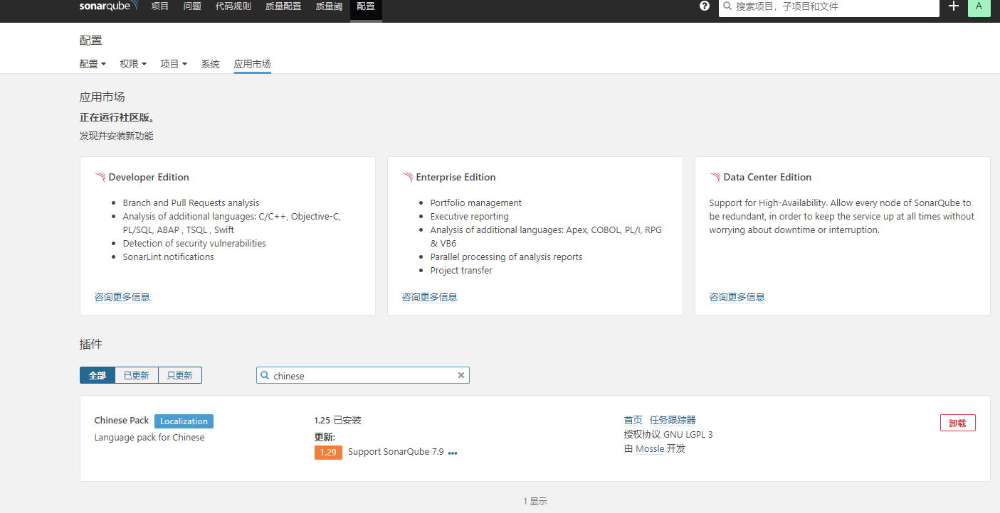
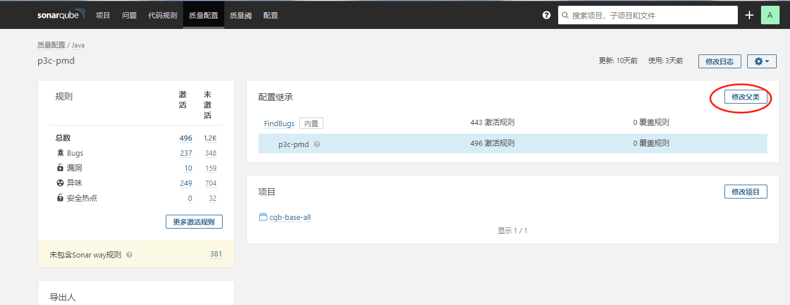

sonar 插件整合文档
==============
## 安装中文插件

## 其他插件安装
再依次安装 SonarJava、findbugs、pmd 插件
## 整合阿里p3c-pmd插件
```
clone https://github.com/caowenliang/sonar-pmd-p3c.git
mvn package
```
将sonar-pmd-plugin-3.2.1.jar上传到sonar部署目录extensions/plugins/ 再重启sonar
## 整合阿里p3c-pmd 和findbugs 质量配置
>1. 只激活阿里的规则（p3c开头的规则）
>2. 在质量配置界面为p3c-pmd 增加规则父类 findbugs
 


